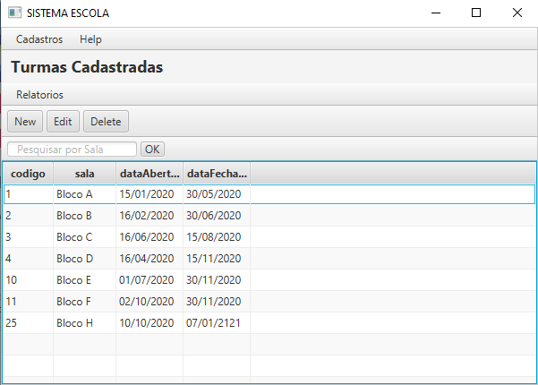

<h1 align="center"> CadastroTurmaJavaFX </h1>

<div align="center">
    
</div>
</div>

<h2> Sobre </h2>

Esse projeto é um pequeno CRUD em JavaFX que insere, atualiza, deleta e realiza pesquisas da uma turma, professores e alunos de uma Escola.

This project is a small CRUD in JavaFX that insert, update, delete and find a class, teacher and studens of a school

<h2> Tecnologias utilizadas </h2>
  <u1>
    <li><a href="https://www.oracle.com/java/technologies/javase/jdk15-archive-downloads.html"> JDK 15 </a> : Java Development Kit 15 - um kit de desenvolvimento para 
    construção de aplicações e componentes usando a linguagem de programação Java;</li>
    <li><a href="https://gluonhq.com/products/javafx"> JavaFX lib</a> : JavaFX Software Development Kit (SDK 15.0.1) um kit que contem ferramentas e tecnologias para desenvolver
    aplicacoes web, desktop e mobile;</li>
    <li><a href="https://dev.mysql.com/downloads/workbench/"> MySQL Workbench</a> : O MySQL Workbench é uma ferramenta visual de design de banco de dados que integra desenvolvimento,
    administração, design, criação e manutenção de SQL em um único ambiente de desenvolvimento integrado para o sistema de banco de dados MySQL.</li>
    <li><a href=https://www.wampserver.com/en/">Wamp Server </a> : é um software que efetua a instalação automática de um conjunto de softwares no computador, de modo a facilitar
    a configuração de um software interpretador de scripts local e um banco de dados no sistema Windows;</li>
    <li><a href="https://gluonhq.com/products/scene-builder/#download"> Scene Builder 15.0.1 </a> : JavaFX Software Development Kit (SDK 15.0.1) um kit que contem ferramentas e tecnologias para desenvolver
    aplicacoes web, desktop e mobile;</li>
  </u1> 

<h3> Intalacao </h2>

Para baixar o código-fonte do projeto em sua máquina, primeiramente voce terá que ter instalado em seu computador o <a href="https://git-scm.com/"> GIT </a>.

Com o Git instalado, em seu terminal execute o seguinte comando:

```
$ git clone https://github.com/jonasmachados/CadastroTurmaJavaFX
```

<h3> Backend </h3>
  
  <u1>
    <li>Com o projeto baixado, importe as Bibliotecas do JavaFX e a SQL Connection</li>
    <li>Em propriedades do projeto cole esse comando no VM Options:
    <b>--module-path "C:\Program Files\Java\javafx-sdk-15.0.1\lib" --add-modules=javafx.fxml,javafx.controls</b> </li>
    <li>Execute o WampServer</li>
  </u1>
  
  <h3> Frontend </h3>
  
  <u1>
    <li>Instale o Scene Builder</li>
    <li>No Netbeans vai em ferramentas/opçoes/java/javaFX e selecione o scene builder</li>
  </u1>

<h2> Author: </h2>

* **Jonas Machado** - *Initial work.*

<h2>  License</h2>

This project is licensed under the MIT License - see the [LICENSE.md](LICENSE.md) file for details

<h2> Agradecimentos</h2>
  <u1>
    <li>A todos que ajudarem a contribuir com o projeto;</li>
    <li>Todos aqueles que utilizarem o codigo para conhecimentos</li>
   </u1>


